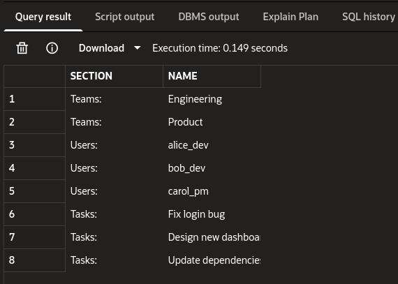

SQL worksheet seed data:

# Lesson 03 — Question Answers

## Exercise 1 — Model Design

### 1. What relationships should Comment have?

Comment should belong to one Task and one User.

### 2. Should Task have a comments relationship?

Yes. Task` should have a comments relationship because one task can have many comments.

### 3. What should happen to comments when a task is deleted?

The comments should be deleted too. A comment belongs to a task, so if the task is gone, the comments do not have a place to live.

---

## Exercise 2 — Migration Creation

### 1. What does `upgrade()` do?

upgrade() moves the database forward. In this activity, it creates the new comments table.

### 2. What does `downgrade()` do?

downgrade() moves the database backward. In this activity, it removes the comments table.

### 3. What happens if you downgrade this migration?

The comments table is dropped. This means the table and the comments inside it are deleted.

---

## Exercise 4 — Migration Rollback

### 1. What happens to the column?

The bad column estimated_hours is removed from the table.

### 2. What happens to the data?

The data inside that column is deleted too. When a column is dropped, its values are lost unless we saved them somewhere else first.

---

## Exercise 5 — Concept Check

### 1. Why use ORM instead of raw SQL?

ORM allow  me  to work with database rows using Python objects. This can make the code easier to read and safer to organize.

### 2. Why use migrations?

Migrations help us track database changes. They make it easier for everyone to have the same database structure.

### 3. When would you rollback?

I would rollback when a migration is wrong, breaks the app, or adds something that should not be there.

### 4. Difference between `add()` and `commit()`?

*add()* puts an object inside the session, but it is not saved forever yet. commit() saves the changes into the database.

### 5. Why are relationships useful?

Relationships are useful because they let me move between connected objects. For example, I can get a team and then see its users without writing a manual join every time.
